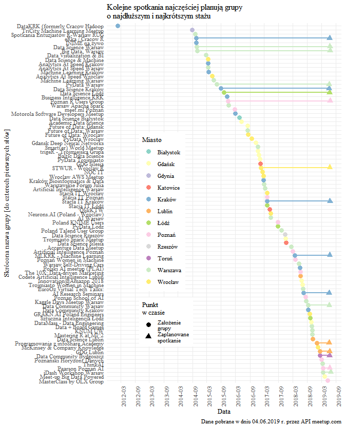

Meetupy data science w Polsce. Stan na 2019-06-04
================

To jest analiza 86 polskich grup meetupowych, które miały wpisany temat
“data science” na dzień 2019-06-04.

Chcę pokazać meetupy w **przestrzeni** (1) i **czasie** (2). Idzie to do
rozdziału, gdzie pokazuję też inne rzeczy poza meetupami, stąd wykres
1.1.

-----

Dane pobrałem przez API meetup.com za pomocą pakietu w Pythonie. Kod i
pliki .json są w /meetup\_api/.

Pliki źródłowe zapisane do R w 1\_read\_json.R

Złączenie danych zrobione w 2\_join.R

## 1 - Przestrzeń

Kod w 3\_space\_viz.R

Wykresy są zrobione pod strukturę i formatowanie pracy doktorskiej
(rozdziały, A4, Times New
Roman).

### 1.1. Lokalizacja działalności świata społecznego data science w Polsce - firmy, studia, meetupy

``` r
plot(groups_firms_edu)
```

<!-- -->

### 1.2. Suma członków grup meetupowych data science i ilość członków na grupę w podziale na 12 polskich miast

``` r
plot(map_bar)
```

<!-- -->

### 1.3. Ilość członków 86 grup meetupowych w podziale na dwanaście polskich miast

``` r
plot(lolli)
```

    ## Warning: Transformation introduced infinite values in continuous y-axis

<!-- -->

## 2 - Czas

### 2.1. Powstawanie grup meetupowych data science w latach 2012 - 2019 (do czerwca)

``` r
plot(n_cumsum_year)
```

    ## Warning: Removed 1 rows containing missing values (geom_point).

    ## Warning: Removed 1 rows containing missing values (geom_segment).

<!-- -->

### 2.2. Termin powstania 86 grup meetupowych data science oraz termin zaplanowanego spotkania w podziale na dwanaście polskich miast

``` r
plot(next_event)
```

    ## Warning: Removed 69 rows containing missing values (geom_segment).

    ## Warning: Removed 69 rows containing missing values (geom_point).

<!-- -->

### 2.3. Powstawanie 86 grup meetupowych data science w podziale na dwanaście polskich miast i w zależność od czasu

``` r
plot(box_dif)
```

<!-- -->

### 2.4. Wybrane terminy w nazwach 86 grup meetupowych data science według roku powstania grupy

``` r
plot(names_time)
```

<!-- -->
